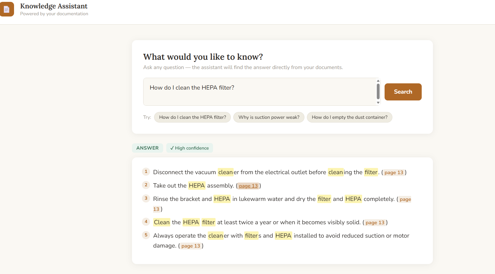
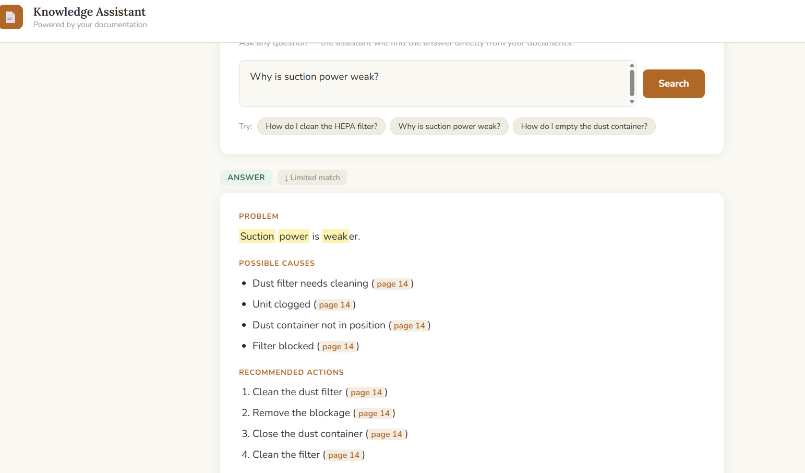
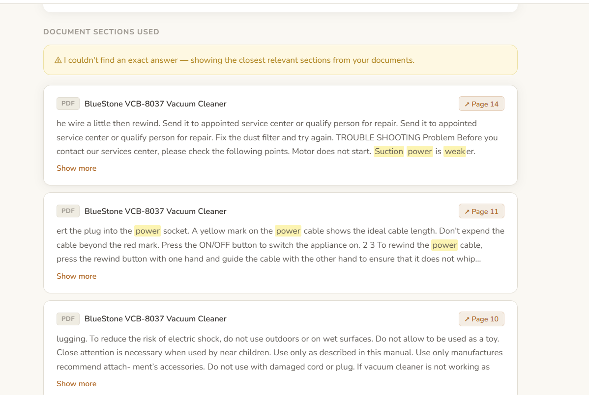
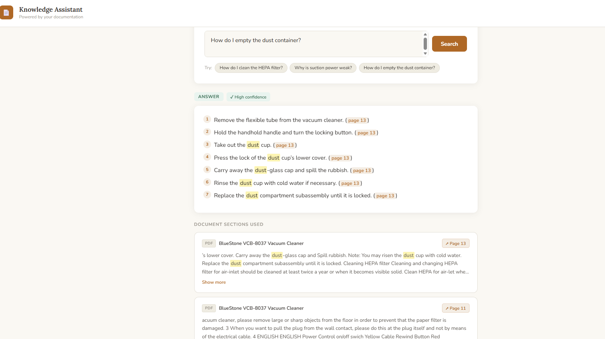
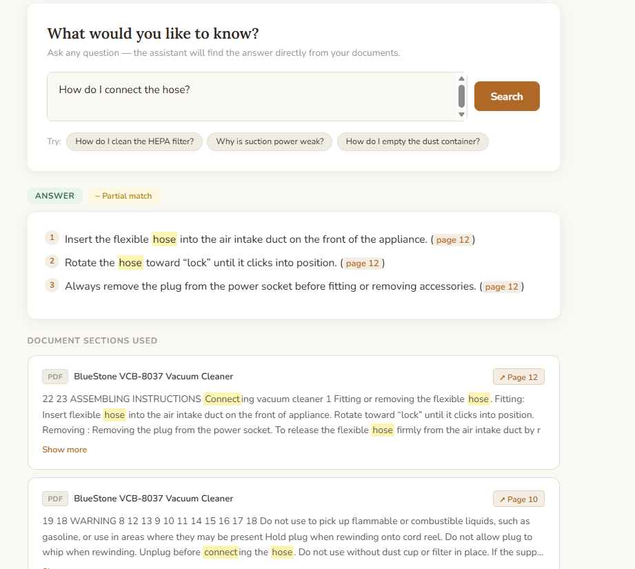
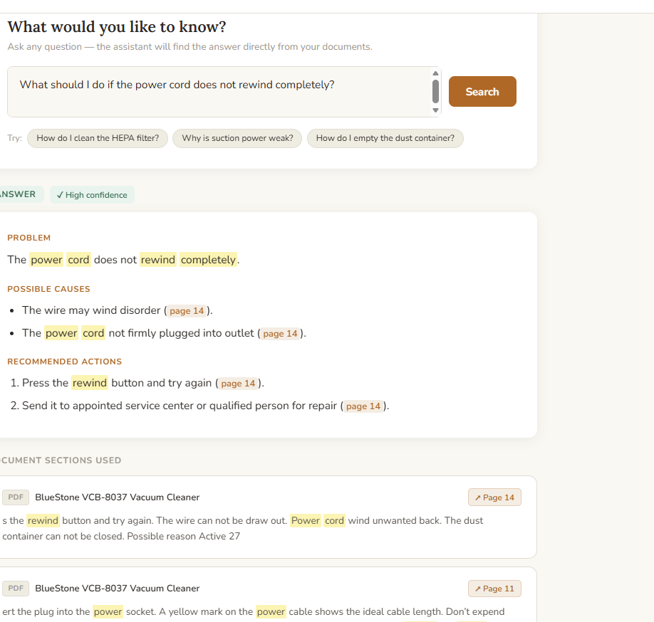
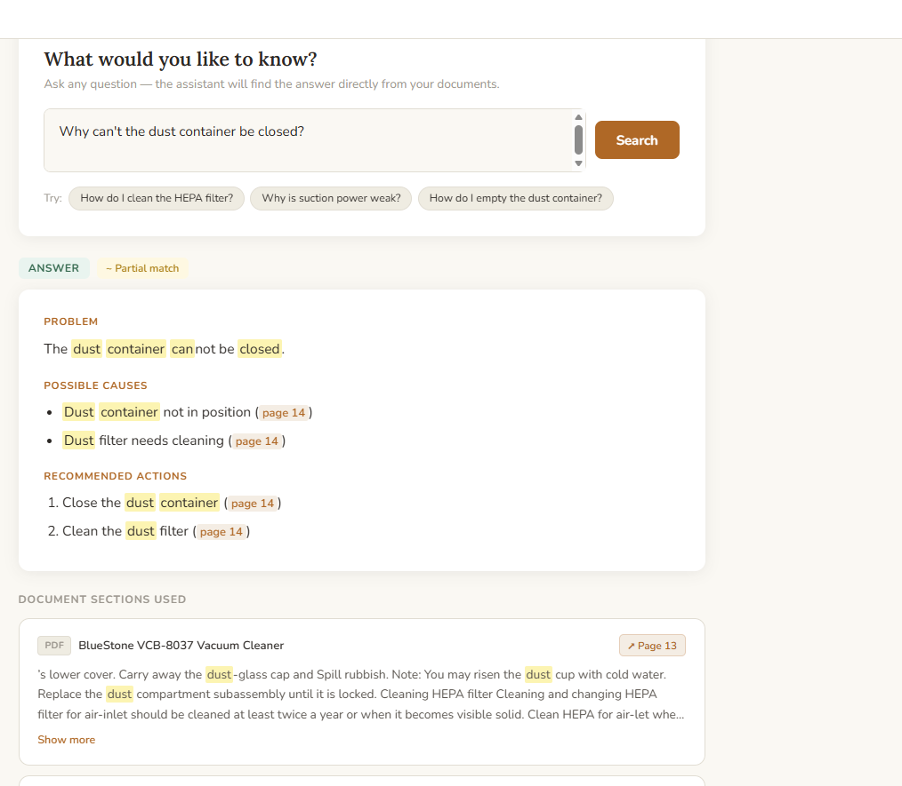
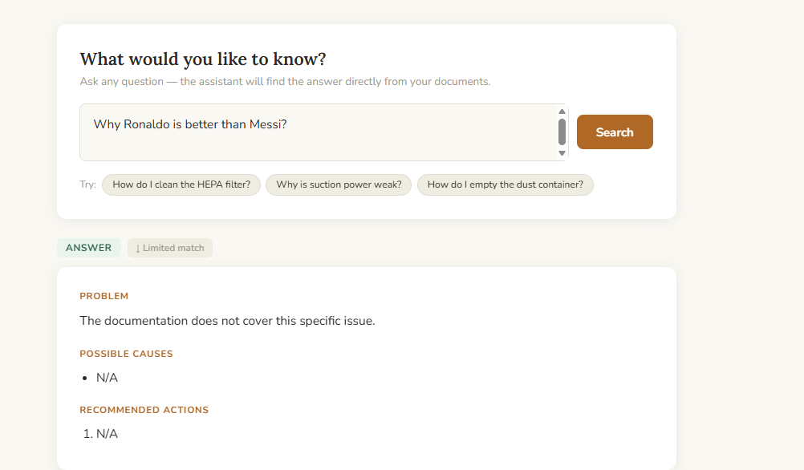

# RAG Agent Based on Documentation

A production-grade Retrieval-Augmented Generation (RAG) system that lets users ask natural language questions against their own PDF/DOCX documentation and receive structured, cited answers — served through a clean web interface.

Built on the **WAT framework** (Workflows → Agents → Tools): deterministic Python tools handle all I/O and data transformation; the LLM only generates text from pre-retrieved context.

---

## Use Cases

The screenshots below demonstrate the system running against a vacuum cleaner product manual (BlueStone VCB-8037). The same pipeline works with any PDF or DOCX documentation.

---

### 1. How-to query — HEPA filter cleaning

> "How do I clean the HEPA filter?"

**High confidence** · Intent: `howto`

The assistant returns numbered steps with inline page citations. Each `(page N)` link opens the source PDF directly at that page.



---

### 2. Troubleshooting — weak suction

> "Why is suction power weak?"

**Medium confidence** · Intent: `troubleshooting`

The answer is structured into three labelled sections: **Problem**, **Possible causes**, and **Recommended actions** — each cause and action linked to its source page.



---

### 3. Document sections panel

Every answer exposes the raw document chunks used to generate it. Each card shows the source file, page number, and a text excerpt. "Show more" expands the full excerpt. Clicking the page badge opens the PDF at the exact page.



---

### 4. How-to query — emptying the dust container

> "How do I empty the dust container?"

**High confidence** · Intent: `howto`

Step-by-step procedure extracted directly from the manual, with the referenced document sections shown below the answer.



---

### 5. How-to query — connecting the hose

> "How do I connect the hose?"

**Medium confidence** · Intent: `howto`

Short two-step procedure with page references. Medium confidence indicates partial overlap between question and indexed content.



---

### 6. Troubleshooting — power cord not rewinding

> "What should I do if the power cord does not rewind completely?"

**Medium confidence** · Intent: `troubleshooting`

The assistant identifies the possible mechanical cause and provides escalation guidance (rewind button → service centre), both cited to specific pages.



---

### 7. Troubleshooting — dust container won't close

> "Why can't the dust container be closed?"

**Medium confidence** · Intent: `troubleshooting`

Structured diagnosis: container misaligned or filter needs cleaning, with specific corrective actions and page links.



---

### 8. Out-of-scope query — graceful fallback

> "Why Ronaldo is better than Messi?"

**Limited match** · Intent: `troubleshooting`

When the question has no relation to the indexed documentation, the assistant explicitly states the documentation does not cover it — instead of hallucinating an answer. The confidence badge shows "↓ Limited match" and a soft-match notice is displayed above the sources.



---

## Architecture Overview

```
┌───────────────────────────────────────────────────────────┐
│                         Client                            │
│            frontend/index.html (vanilla JS)               │
└────────────────────────┬──────────────────────────────────┘
                         │ HTTP POST /query
┌────────────────────────▼──────────────────────────────────┐
│                   FastAPI API Server                       │
│               tools/api_server.py :8000                   │
│                                                           │
│  1. detect_intent()  → troubleshooting | howto | general  │
│  2. embed_question() → OpenAI embeddings API              │
│  3. retrieve_chunks()→ ChromaDB cosine similarity search  │
│  4. build_context()  → numbered source headers + text     │
│  5. generate_answer()→ gpt-4o-mini (structured prompt)    │
└────────────────────────┬──────────────────────────────────┘
          ┌──────────────┘
          │
  ┌───────▼────────┐    ┌──────────────────┐
  │   ChromaDB     │    │   OpenAI API     │
  │  (local disk)  │    │ embeddings + LLM │
  │  chroma_db/    │    └──────────────────┘
  └────────────────┘
```

### WAT Layers

| Layer | What it is | Where |
|---|---|---|
| **Workflows** | Markdown SOPs defining objectives, inputs, outputs, edge cases | `workflows/` |
| **Agents** | Orchestration logic — reads workflow, calls tools in sequence | `tools/api_server.py`, `tools/query_rag.py` |
| **Tools** | Deterministic Python scripts — no LLM calls, no surprises | `tools/ingest_docs.py`, `tools/query_rag.py` |

---

## How Embeddings Work

Embeddings are dense numerical vectors that encode semantic meaning. Two sentences with similar meaning produce vectors that point in nearly the same direction in high-dimensional space — even if they share no words.

### Ingestion pipeline (`tools/ingest_docs.py`)

```
PDF/DOCX file
    │
    ▼
Text extraction (PyMuPDF / python-docx)
    │  • Per-page for PDFs — preserves page numbers in metadata
    │  • Ligature fix: re-encodes Latin-1-misread UTF-8 bytes
    │    e.g. \u00ef\u00ac\udc81 → "fi" (from PDF fi ligature U+FB01)
    ▼
Chunking
    │  Each page = one chunk (natural document boundary)
    ▼
Embedding  ←─── OpenAI text-embedding-3-small (1536 dimensions)
    │  One API call per chunk
    ▼
ChromaDB upsert
    │  Stored with metadata: { source, page, chunk_index, doc_hash }
    ▼
Persisted to chroma_db/ (local disk, no server needed)
```

### Query pipeline (`tools/query_rag.py`)

```
User question (string)
    │
    ▼
Embed question ←─── same model: text-embedding-3-small
    │
    ▼
ChromaDB cosine similarity search
    │  Returns top-k chunks ranked by distance (0 = identical, 2 = opposite)
    │  No distance threshold — all top-k always returned to avoid silent misses
    ▼
Build context string
    │  "[1] Source: manual.pdf, page 14\n<chunk text>\n---\n[2] ..."
    ▼
LLM generation ←─── gpt-4o-mini with intent-specific system prompt
    │  Intent detected via regex:
    │    troubleshooting → structured Problem/Causes/Actions sections
    │    howto           → numbered steps
    │    general         → plain paragraphs
    │  LLM instructed to cite (page N) after every claim
    ▼
Structured answer + source list + confidence score
```

### Confidence scoring

Based on the cosine distance of the best (closest) retrieved chunk:

| Distance | Confidence | Meaning |
|---|---|---|
| < 0.90 | **High** | Near-exact semantic match |
| 0.90 – 1.10 | **Medium** | Related but not specific |
| ≥ 1.10 | **Low** | Weak match — answer may be unreliable |

> ChromaDB returns cosine distance (not similarity): `distance = 1 - cosine_similarity`. A distance of 0.0 means identical vectors.

---

## Project Structure

```
.
├── docs/                    # Source documents (PDFs, DOCX) — not committed
├── chroma_db/               # ChromaDB vector index — regenerated, not committed
├── frontend/
│   └── index.html           # Single-file web UI (vanilla JS, no build step)
├── tools/
│   ├── ingest_docs.py       # Ingest docs → chunk → embed → store in ChromaDB
│   ├── query_rag.py         # Embed question → retrieve → generate answer
│   ├── api_server.py        # FastAPI server wiring everything together
│   └── test_connection.py   # Smoke test for API keys and ChromaDB
├── workflows/               # Markdown SOPs for each pipeline stage
├── .env                     # API keys (never commit this)
├── requirements.txt
└── README.md
```

---

## Prerequisites

- Python 3.10+
- An [OpenAI API key](https://platform.openai.com/api-keys) (used for both embeddings and LLM)

---

## Setup

### 1. Clone and create virtualenv

```bash
git clone <repo-url>
cd RagAgentBasedOnDocuemntation
python -m venv venv
source venv/bin/activate        # Windows: venv\Scripts\activate
pip install -r requirements.txt
```

### 2. Configure environment

```bash
cp .env.example .env
```

Edit `.env`:

```env
OPENAI_API_KEY=sk-...
```

### 3. Add your documents

Drop PDF or DOCX files into the `docs/` directory:

```bash
docs/
├── product-manual.pdf
├── troubleshooting-guide.pdf
└── faq.docx
```

### 4. Ingest documents

```bash
# On Windows (bash) — load .env then run
export $(cat .env | grep -v '^#' | xargs) && python tools/ingest_docs.py

# Reset and re-index from scratch (use after changing documents)
export $(cat .env | grep -v '^#' | xargs) && python tools/ingest_docs.py --reset
```

This embeds every page of every document and stores it in `chroma_db/`. Expect ~1 OpenAI API call per page. With 50 pages: < $0.01 at current pricing.

### 5. Start the server

```bash
export $(cat .env | grep -v '^#' | xargs) && python tools/api_server.py
```

Open **[http://localhost:8000](http://localhost:8000)** in your browser.

---

## API Reference

### `POST /query`

Ask a question against the indexed documents.

**Request**
```json
{
  "question": "Why is suction power weak?",
  "top_k": 5
}
```

**Response**
```json
{
  "answer": "Problem:\nSuction is reduced due to a full dust container or blocked filter.\n\nPossible causes:\n- Dust container full (page 14)\n- HEPA filter clogged (page 13)\n\nRecommended actions:\n- Empty the dust container (page 14)\n- Clean or replace the HEPA filter (page 13)",
  "sources": [
    {
      "source": "manual.pdf",
      "excerpt": "If suction is reduced, check that the dust container...",
      "distance": 0.8732,
      "page": 14,
      "doc_url": "/docs/manual.pdf#page=14"
    }
  ],
  "confidence": "High",
  "intent": "troubleshooting"
}
```

### `GET /status`

```json
{ "status": "ready", "indexed_chunks": 53 }
```

### `GET /docs/{filename}#page=N`

Serves source documents directly. The `#page=N` fragment navigates the browser's PDF viewer to the cited page.

---

## Running Tools Directly

```bash
# Test API key and ChromaDB connectivity
python tools/test_connection.py

# Query from the CLI (no server needed)
python tools/query_rag.py --question "How do I clean the HEPA filter?"
python tools/query_rag.py --question "Why is there no suction?" --top-k 8
```

---

## Adding New Documents

1. Copy new files into `docs/`
2. Re-run ingest with `--reset` to rebuild the index cleanly:
   ```bash
   export $(cat .env | grep -v '^#' | xargs) && python tools/ingest_docs.py --reset
   ```
3. The server picks up the new index automatically on next query (no restart needed)

---

## Key Design Decisions

**No distance threshold on retrieval.** An early version filtered chunks with `distance <= 1.0`. This silently dropped relevant content — e.g. a troubleshooting section with distance 1.07 was never returned. The LLM prompt is the safety valve: it's instructed to say "not found" if context is insufficient.

**Per-page chunking.** Chunking by page (rather than fixed token windows) preserves page numbers as ground truth for citations. It also avoids splitting mid-sentence at artificial token boundaries.

**Ligature fix.** PyMuPDF reads PDF fi/fl ligatures (Unicode U+FB01/U+FB02) as raw UTF-8 bytes decoded as Latin-1, producing garbled characters. `fix_pdf_text()` re-encodes as Latin-1 then decodes as UTF-8 to recover the original text.

**Intent routing.** A regex classifier routes questions to one of three system prompts before any LLM call. This produces deterministic, structured output formats (sections for troubleshooting, numbered steps for how-to) without post-processing.

---

## Tech Stack

| Component | Technology |
|---|---|
| Embeddings | OpenAI `text-embedding-3-small` |
| LLM | OpenAI `gpt-4o-mini` |
| Vector store | ChromaDB (local, persistent) |
| PDF parsing | PyMuPDF (`fitz`) |
| DOCX parsing | python-docx |
| API server | FastAPI + Uvicorn |
| Frontend | Vanilla JS, no build step |
